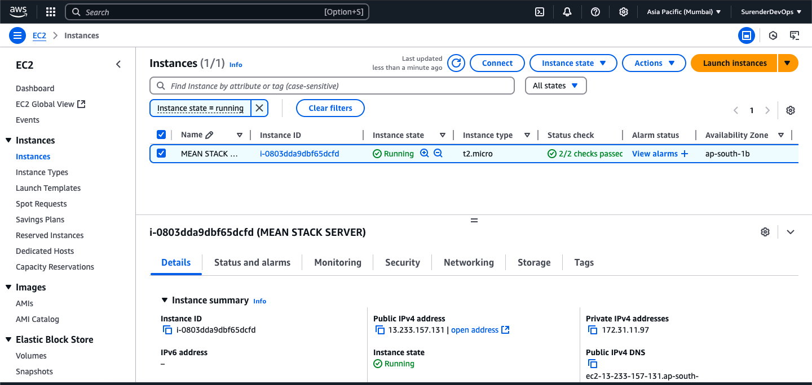

# MEAN Stack Application - Dockerized

This repository contains a **MEAN (MongoDB, Express, Angular, Node.js) stack application** containerized with **Docker** and managed using **Docker Compose**.

## Prerequisites
Ensure you have the following installed before proceeding:
- VM (AWS EC2)
- [Docker](https://www.docker.com/get-started)
- [Docker Compose](https://docs.docker.com/compose/install/)
- Node.js (if running locally without Docker)

---
## **AWS EC2 - Setup**
### **1. Create EC2 Machine on AWS Mumbai Region**
1. Create EC2 Machine config
- OS: ubuntu
- key: mumbai.pem
- Security Group
  - Ports
  - 22
  - 80
  - 443
  - 5000
  - 8081

2. Setup EC2
```bash
sudo apt update
sudo apt-get install ca-certificates curl -y

sudo install -m 0755 -d /etc/apt/keyrings
sudo curl -fsSL https://download.docker.com/linux/ubuntu/gpg -o /etc/apt/keyrings/docker.asc
sudo chmod a+r /etc/apt/keyrings/docker.asc

echo \
  "deb [arch=$(dpkg --print-architecture) signed-by=/etc/apt/keyrings/docker.asc] https://download.docker.com/linux/ubuntu \
  $(. /etc/os-release && echo "${UBUNTU_CODENAME:-$VERSION_CODENAME}") stable" | \
  sudo tee /etc/apt/sources.list.d/docker.list > /dev/null
sudo apt-get update

sudo apt-get install docker-ce docker-ce-cli containerd.io docker-buildx-plugin docker-compose-plugin -y
sudo apt install docker-compose -y

sudo usermod -aG docker $USER
newgrp docker

docker --version
docker-compose --version
docker ps

chmod 600 ~/.ssh/authorized_keys
chmod 700 ~/.ssh

sudo apt install nginx -y

```

Change file `sudo nano /etc/ssh/sshd_config` uncomment line `PubkeyAuthentication yes`

## **Nginx Reverse Proxy Setup**
Create an Nginx config file `/etc/nginx/sites-available/mean-app:`
```nginx
server {
    listen 80;

    location / {
        proxy_pass http://localhost:8081;
        proxy_set_header Host $host;
        proxy_set_header X-Real-IP $remote_addr;
        proxy_set_header X-Forwarded-For $proxy_add_x_forwarded_for;
        proxy_set_header X-Forwarded-Proto $scheme;
    }

    location /api/ {
        proxy_pass http://localhost:5000;  # Removed trailing slash
        proxy_set_header Host $host;
        proxy_set_header X-Real-IP $remote_addr;
        proxy_set_header X-Forwarded-For $proxy_add_x_forwarded_for;
        proxy_set_header X-Forwarded-Proto $scheme;
    }
}

```

Enable and restart:
```bash
sudo ln -s /etc/nginx/sites-available/mean-app /etc/nginx/sites-enabled/
sudo nginx -t
sudo systemctl restart nginx
```

If error like: 
```
2025/04/10 13:47:01 [emerg] 5963#5963: open() "/etc/nginx/sites-enabled/default.old" failed (2: No such file or directory) in /etc/nginx/nginx.conf:60
nginx: configuration file /etc/nginx/nginx.conf test failed

```

**Remove default File From** `sudo rm /etc/nginx/sites-enabled/default.old`
**Test Nginx server** `sudo nginx -t`
**Restart Nginx Server** `sudo systemctl restart nginx`
**Check Status Nginx Server** `sudo systemctl status nginx`


## **Backend - Docker Setup**

### **1. Create a Dockerfile in the Backend Folder**
Before building the Dockerfile, ensure MongoDB is running and create a `.env` file inside the backend folder with:
```
PORT=5000
```

**Dockerfile (backend):**
```dockerfile
FROM node:18

WORKDIR /app

COPY package*.json ./

RUN npm install

COPY . .

EXPOSE 5000

CMD ["node", "server.js"]
```

### **2. Build the Docker Image**
Run the following command to build the backend image:
```bash
docker build -t mean-backend:latest .
```

### **3. Run the Docker Container**
```bash
docker run -d -p 5000:5000 mean-backend:latest
```

---

## **Frontend - Docker Setup**

### **1. Create a Dockerfile in the Frontend Folder**
Ensure MongoDB is running and update `tutorial.service.ts` to change the base URL port from `8080` to `5000`.

**Dockerfile (frontend):**
```dockerfile
FROM node:18-alpine AS builder
WORKDIR /app
COPY package*.json ./
RUN npm install
COPY . .
RUN npm run build --prod

FROM nginx:alpine
COPY --from=builder /app/dist/angular-15-crud /usr/share/nginx/html

EXPOSE 80

CMD ["nginx", "-g", "daemon off;"]
```

### **2. Build the Docker Image**
```bash
docker build -t mean-frontend:latest .
```

### **3. Run the Docker Container**
```bash
docker run -d -p 8081:80 mean-frontend:latest
```


---

## **Docker Compose Setup**

### **1. Create `docker-compose.yml`**
This file defines the backend, frontend, and MongoDB services.

```yaml
version: "3"
services:
  backend:
    image: mean-backend:latest
    container_name: mean-backend
    ports:
      - "5000:5000"
    depends_on:
      - mongo
    environment:
      - MONGO_URL=mongodb://mongo:27017/dd_db
  
  frontend:
    image: mean-frontend:latest
    environment:
      - API_URL=http://13.233.157.131/api/tutorials
    container_name: mean-frontend
    ports:
      - "8081:80"
    depends_on:
      - backend
      
  mongo:
    image: mongo:latest
    container_name: mongo
    ports:
      - "27017:27017"
    volumes:
      - mongo-data:/data/db

volumes:
  mongo-data:
```

### **2. Deploy the Application using Docker Compose**
```bash
docker-compose up -d
```

### **3. Stop and Remove Containers**
```bash
docker-compose down
```

## **CI/CD Pipeline Setup**
**GitHub Actions (`.github/workflows/deploy.yml`)**

```yaml
name: CI/CD Pipeline
on:
  push:
    branches:
      - master

jobs:
  build-and-deploy:
    runs-on: ubuntu-latest
    steps:
      - name: Checkout Repository
        uses: actions/checkout@v3

      - name: Login to Docker Hub
        run: echo "${{ secrets.DOCKER_PASSWORD }}" | docker login -u "${{ secrets.DOCKER_USERNAME }}" --password-stdin

      - name: Build and Push Backend
        run: |
          cd backend
          docker build -t surendergupta/mean-backend:latest .
          docker push surendergupta/mean-backend:latest

      - name: Build and Push Frontend
        run: |
          cd frontend
          docker build -t surendergupta/mean-frontend:latest .
          docker push surendergupta/mean-frontend:latest

      - name: Deploy on VM
        uses: appleboy/ssh-action@v1
        with:
          host: ${{ secrets.VM_HOST }}
          port: 22
          username: ${{ secrets.VM_USER }}
          key: ${{ secrets.SSH_PRIVATE_KEY }}
          script: |
            ls 
            pwd
            docker pull surendergupta/mean-backend:latest
            docker pull surendergupta/mean-frontend:latest
            cd /home/ubuntu/mean-app/
            docker-compose down
            docker-compose up -d

```
---

## **Notes & Troubleshooting**

### **MongoDB Connection Issues**
- **For Docker Compose Deployment:** Use `mongodb://mongo:27017/dd_db`
- **For Local MongoDB Deployment:** Use `mongodb://localhost:27017/dd_db`
- **For MongoDB Atlas Deployment:** Use the provided Atlas connection string

### **CORS Configuration (Backend - `server.js`)**
Ensure CORS is enabled to allow frontend access:
```js
const cors = require("cors");
app.use(cors());
```

### **Fix for `strictQuery` Warning in Mongoose**
Set `strictQuery` to `false` in `server.js` to avoid issues with MongoDB queries:
```js
mongoose.set("strictQuery", false);
```

---

## **Access the Application**
- **Backend API:** http://13.233.157.131/api/tutorials
- **Frontend UI:** http://13.233.157.131/

---
## **Screenshots**

1. EC2 VM



2. GitHub Secrets


3. GitActions


4. Docker Hub


5. Docker Container using Docker-composer


6. Application Working


---

## **Author**
- **Surender Gupta** 🚀
- Contact: [Github](https://github.com/surendergupta) | [LinkedIn](https://www.linkedin.com/in/surender-gupta/)

---

## **License**
This project is licensed under the MIT License. Feel free to modify and use it as needed.

